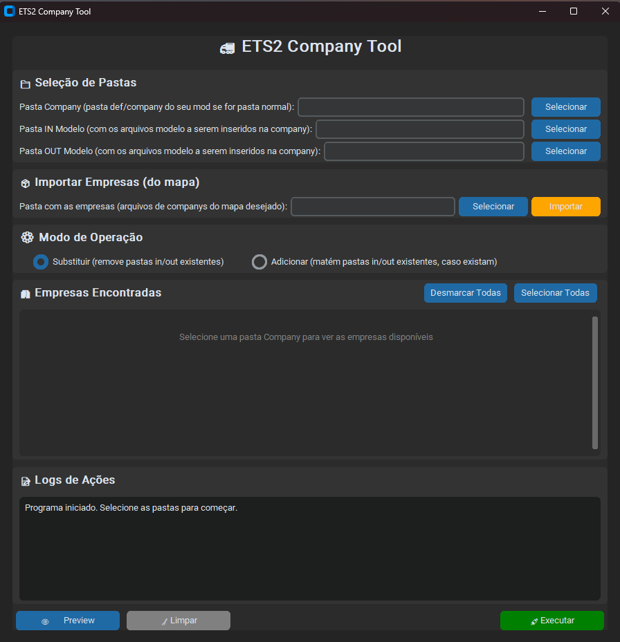

<p align="center">
  <h1 align="center">🚛 ETS2 Company Tool</h1>
  <p align="center">
    <strong>Ferramenta para facilitar a criação de mods de empresas para Euro Truck Simulator 2</strong>
  </p>
</p>

<p align="center">
  
  
  
  
</p>

<p align="center">
  
  
</p>

---

## 📋 Sobre o Projeto

O **ETS2 Company Tool** é uma ferramenta desenvolvida para automatizar o processo de criação e configuração de mods de empresas para o Euro Truck Simulator 2. 

Com ela, você pode facilmente copiar arquivos de carga (`.sii`) para centenas de empresas com apenas alguns cliques, economizando horas de trabalho manual.

### 🎯 O Problema que Resolve

Ao criar mods de cargas para ETS2, você precisa:
1. Ter uma lista de empresas do mapa
2. Criar pastas `in/` e `out/` dentro de cada empresa
3. Copiar os arquivos de carga para cada uma dessas pastas

**Com 200+ empresas, isso é extremamente tedioso e cansativo!**

### ✨ A Solução

O ETS2 Company Tool automatiza todo esse processo:
- 📦 Extrai arquivos `.scs` automaticamente
- 🏢 Importa listas de empresas de mapas
- 📋 Copia arquivos modelo para todas as empresas selecionadas
- 🗜️ Recompacta tudo em um novo `.scs` pronto para usar

---

## 🚀 Funcionalidades

| Funcionalidade | Descrição |
|----------------|-----------|
| 📂 **Suporte a .scs** | Extrai e recompacta arquivos `.scs` automaticamente |
| 🏢 **Importação de Empresas** | Importa empresas de pastas de mapas |
| ✅ **Seleção Individual** | Escolha quais empresas processar |
| 🔄 **Modo Substituir/Adicionar** | Substitui ou mantém arquivos existentes |
| 📊 **Progresso em Tempo Real** | Acompanhe o progresso das operações |
| 🧹 **Limpeza Automática** | Remove arquivos temporários automaticamente |
| 📝 **Log Detalhado** | Registro de todas as ações realizadas |

---

## 🖥️ Screenshots

<p align="center">
  
</p>

> 💡 *Interface moderna com tema escuro*

---

## ⚠️ Pré-requisitos

> **Esta ferramenta NÃO cria cargas!** Ela apenas automatiza a cópia de arquivos já existentes.

Para usar o ETS2 Company Tool, você precisa ter:

1. **Arquivos modelo de carga** (`.sii`) que você já criou ou obteve
2. **Um mod ou pasta de destino** onde as cargas serão copiadas
3. **Companys dos Mapas Desejados** Uma pasta de company de mapa para importar a lista de empresas

📦 Os arquivos modelo são os arquivos `.sii` de carga que você quer distribuir para múltiplas empresas. A ferramenta copia esses arquivos para as pastas `in/` e `out/` de cada empresa selecionada.

---

## 📦 Instalação

### Opção 1: Executável (Recomendado)

1. Baixe o arquivo `ETS2CompanyTool.exe` da seção [Releases](https://github.com/seu-usuario/ets2-company-tool/releases)
2. Execute o arquivo
3. Pronto! Não precisa instalar nada

### Opção 2: Executar via Python

```bash
# Clone o repositório
git clone https://github.com/seu-usuario/ets2-company-tool.git

# Entre na pasta
cd ets2-company-tool

# Instale as dependências
pip install customtkinter

# Execute
python main.py
```

---

## 📖 Como Usar

### Passo a Passo

```
1️⃣ Selecione a Pasta Company
   └── Escolha o arquivo .scs desbloqueado do seu mod OU se for uma pasta descompactada normal do seu mod, 
       direcione até a pasta def/company. Caso não tenha, será criada automaticamente, não se preocupe

2️⃣ Importe as Empresas
   └── Selecione a pasta com as empresas do mapa
   └── Clique em "Importar"

3️⃣ Selecione as Pastas Modelo
   └── Pasta IN: arquivos que vão para /in/
   └── Pasta OUT: arquivos que vão para /out/

4️⃣ Escolha o Modo
   └── Substituir: remove in/out existentes
   └── Adicionar: mantém arquivos existentes

5️⃣ Selecione as Empresas
   └── Marque/desmarque as empresas desejadas

6️⃣ Execute!
   └── Clique em "Executar"
   └── Aguarde a conclusão
   └── Se era .scs, será criado um novo arquivo modificado
```

### Estrutura de Arquivos

```
📁 Seu Mod (.scs ou pasta)
└── 📁 def/
    └── 📁 company/
        ├── 📁 empresa_1/
        │   ├── 📁 in/
        │   │   └── 📄 carga.sii
        │   └── 📁 out/
        │       └── 📄 carga.sii
        ├── 📁 empresa_2/
        │   ├── 📁 in/
        │   └── 📁 out/
        └── ...
```

---

## 🛠️ Stack Tecnológica

<p align="center">
  
  
  
  
</p>

| Tecnologia | Uso |
|------------|-----|
| **Python 3.14** | Linguagem principal |
| **CustomTkinter** | Interface gráfica moderna |
| **Tkinter** | Diálogos nativos do sistema |
| **os / shutil** | Manipulação de arquivos |
| **zipfile** | Leitura/escrita de .scs (ZIP) |
| **PyInstaller** | Geração do executável |

---

## 📁 Estrutura do Projeto

```
ets2-company-tool/
├── 📄 main.py              # Código principal da aplicação
├── 📄 README.md            # Este arquivo
├── 📄 .gitignore           # Arquivos ignorados pelo Git
├── 📄 ETS2CompanyTool.spec # Configuração do PyInstaller
├── 📁 dist/
│   └── 📄 ETS2CompanyTool.exe  # Executável
├── 📁 build/               # Arquivos temporários (ignorado)
└── 📁 docs/
    └── 📄 screenshot.png   # Screenshots
```

---

## 🤝 Contribuindo

Contribuições são bem-vindas! 🎉

Leia o guia completo em [CONTRIBUTING.md](CONTRIBUTING.md) para saber como:

- 🐛 Reportar bugs
- 💡 Sugerir funcionalidades
- 🔧 Enviar código

Por favor, siga nosso [Código de Conduta](CODE_OF_CONDUCT.md).

---

## 📝 Licença

Este projeto é open source e está sob a licença **MIT**. 

Isso significa que você pode:
- ✅ Usar comercialmente
- ✅ Modificar
- ✅ Distribuir
- ✅ Usar privativamente

Veja o arquivo [LICENSE](LICENSE) para mais detalhes.

---

## 👨‍💻 Autor

Desenvolvido para a comunidade de modders do ETS2 🚛

**Contribuidores são bem-vindos!**

---

<p align="center">
  <strong>⭐ Se este projeto te ajudou, deixe uma estrela!</strong>
</p>

<p align="center">
  
  
</p>